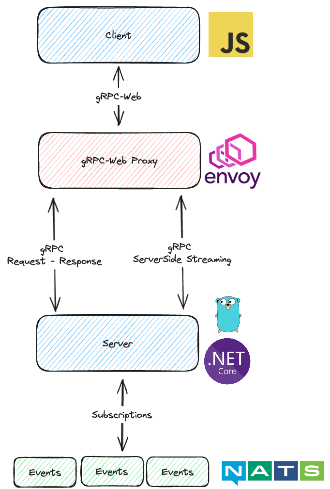

# gRPC-Web Streaming example

Combining information from these sources:

- [gRPC-Web Basic Tutorial](https://grpc.io/docs/platforms/web/basics/)
- [gRPC-Web GitHub Examples](https://github.com/grpc/grpc-web/tree/master/net/grpc/gateway/examples/helloworld)



_gRPC dataflow_

## gRPC Streaming Types


_Types of gRPC Streaming_

## gRPC Implementations

This repository holds the following gRPC example implementations for the `GreeterService` described in [greeter-service.proto](./greeter-service.proto):

| Folder         | Description                          |
| -------------- | ------------------------------------ |
| server         | GO gRPC Server implementation        |
| server.net     | .Net Core gRPC Server implementation |
| client         | Vanilla JavaScript gRPC-Web client   |
| client-angular | Angular gRPC-Web client              |

## Generate Code

Each separate implementation in the repository has its own `proto-gen.sh` file (except server.net that does this though the .sln file)

```sh
# Server
cd server;
./proto-gen.sh
```

```sh
# Client
cd client
npm install
./proto-gen.sh
```

```sh
# Angular Client
cd client-angular
npm install
./proto-gen.sh
```

## Start the system

### Server GO

    cd server
    go run main.go

### Server .NET

    cd server.net
    dotnet run --project grpcWeb

### gRPC-Web Proxy

Run a proxy to support gRPC and gRPC-Web between server and client

    npm install -g @grpc-web/proxy
    npx @grpc-web/proxy --target http://0.0.0.0:9090 --listen 8080

### Angular Client

    cd client-angular
    npm install
    ng serve

### Vanilla JavaScript Client

    cd client
    # May be needed
    export NODE_OPTIONS=--openssl-legacy-provider
    npm install
    npx webpack client.js

#### Run the client in a webserver

    python3 -m http.server 8081 &

#### Nice to know commands

    jobs

    fg
    fg %1

    bg
    bg %1

    kill %1

#### See the Result

Visit `localhost:8081` and watch the console (Chrome: `F12`).

## Proxy and NATS

`Envoy` is included in the `docker-compose` file togheter with `NATS` in this example

You can run the grpc-web development proxy with an `npx` command, or run `Envoy` as a proper proxy.
Envoy can get into trouble, so using the `npx` command with `grpc-web/proxy` is preferred :)

### Start the Environment

    docker-compose up -d

#### Manual Proxy start just for reference

##### 1. grpc-web/proxy

    npx @grpc-web/proxy --target http://0.0.0.0:9090 --listen 8080

##### 2. Envoy

    docker run --rm -d -v "$(pwd)"/envoy.yaml:/etc/envoy/envoy.yaml:ro -p 8080:8080 -p 9901:9901 envoyproxy/envoy:v1.22.0

## Publish NATS Messages

    nats pub foo.bar.heartbeat --count=10 --sleep 500ms "publication #{{Count}} @ {{TimeStamp}}"

    nats pub foo.bar.timeseries --count=10 --sleep 500ms "publication #{{Count}} @ {{TimeStamp}}"
