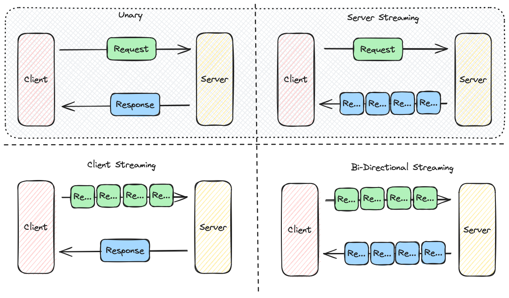

# gRPC-Web Streaming example

Combining information from these sources:

- [gRPC-Web Basic Tutorial](https://grpc.io/docs/platforms/web/basics/)
- [gRPC-Web GitHub Examples](https://github.com/grpc/grpc-web/tree/master/net/grpc/gateway/examples/helloworld)

_gRPC dataflow_

## gRPC Streaming Types

_Types of gRPC Streaming_

## Genarate Code

### Generate Server and Client proto files

    protoc -I=. --go_out=./server --go-grpc_out=./server ./greeter-service.proto
    protoc -I=. --js_out=import_style=commonjs:./client ./greeter-service.proto
    protoc -I=. --grpc-web_out=import_style=commonjs,mode=grpcwebtext:./client ./greeter-service.proto

### Generate client code

    cd client
    (May be needed) export NODE_OPTIONS=--openssl-legacy-provider
    npm install
    npx webpack client.js

## Start the system

### Server

    cd server
    go run main.go

## Proxy and NATS

`Envoy` is included in the `docker-compose` file togheter with `NATS` in this example

You can run the grpc-web development proxy with an `npx` command, or run `Envoy` as a proper proxy.

### Start the Environment

    docker-compose up -d

#### Manual Proxy start just for reference

##### 1. grpc-web/proxy

    cd client
    npx @grpc-web/proxy --target http://0.0.0.0:9090 --listen 8080

##### 2. Envoy

    docker run --rm -d -v "$(pwd)"/envoy.yaml:/etc/envoy/envoy.yaml:ro -p 8080:8080 -p 9901:9901 envoyproxy/envoy:v1.22.0

### Run the client in a webserver

    cd client
    python3 -m http.server 8081 &

### Nice to know commands

    jobs

    fg
    fg %1

    bg
    bg %1

    kill %1

## See the Result

Visit `localhost:8081` and watch the console (Chrome: `F12`).

## Publish NATS Messages

    nats pub foo.bar.heartbeat --count=10 --sleep 500ms "publication #{{Count}} @ {{TimeStamp}}"

    nats pub foo.bar.timeseries --count=10 --sleep 500ms "publication #{{Count}} @ {{TimeStamp}}"
